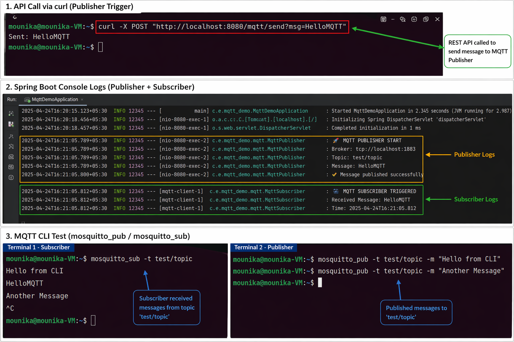

# 🚀 MQTT Spring Boot Demo (Linux)

## 📌 Overview

This project demonstrates a simple MQTT-based messaging system using Spring Boot.

It implements:

* MQTT Publisher (sends messages)
* MQTT Subscriber (receives messages)
* REST API trigger
* End-to-end message flow using MQTT broker

---

## 🧱 Tech Stack

* Java 17
* Spring Boot
* MQTT (Eclipse Mosquitto)
* Spring Integration MQTT
* Maven
* Linux (Ubuntu)

---

## 📦 Dependencies

```xml
<dependencies>

    <!-- Spring Boot Web -->
    <dependency>
        <groupId>org.springframework.boot</groupId>
        <artifactId>spring-boot-starter-web</artifactId>
    </dependency>

    <!-- MQTT Integration -->
    <dependency>
        <groupId>org.springframework.integration</groupId>
        <artifactId>spring-integration-mqtt</artifactId>
    </dependency>

    <!-- MQTT Client -->
    <dependency>
        <groupId>org.eclipse.paho</groupId>
        <artifactId>org.eclipse.paho.client.mqttv3</artifactId>
        <version>1.2.5</version>
    </dependency>

</dependencies>
```

---

## ⚙️ How to Run (Linux)

### 1️⃣ Install MQTT Broker

Install Eclipse Mosquitto:

```bash
sudo apt update
sudo apt install mosquitto mosquitto-clients -y
```

Start broker:

```bash
sudo systemctl start mosquitto
```

Check status:

```bash
sudo systemctl status mosquitto
```

---

### 2️⃣ Install Java & Maven

```bash
sudo apt install openjdk-17-jdk maven -y
```

Verify:

```bash
java -version
mvn -version
```

---

### 3️⃣ Run Spring Boot Application

```bash
mvn clean install
mvn spring-boot:run
```

---

## 🧪 Testing the Application

### ✅ Test via REST API

```bash
curl -X POST "http://localhost:8080/mqtt/send?msg=HelloMQTT"
```

### ✅ Expected Output (Console)

```
🌐 API HIT: /mqtt/send
🚀 MQTT PUBLISHER START
📤 Publishing message...
📩 MQTT SUBSCRIBER TRIGGERED
Received Message: HelloMQTT
```

---

### ✅ Test via MQTT CLI

#### Terminal 1 (Subscriber):

```bash
mosquitto_sub -t test/topic
```

#### Terminal 2 (Publisher):

```bash
mosquitto_pub -t test/topic -m "Hello from CLI"
```
## 📷 Screenshots



---

## 🔄 Architecture

REST API → Publisher → MQTT Broker → Subscriber

---


## 🎯 Features

* Asynchronous messaging using MQTT
* Publisher-Subscriber architecture
* Real-time message processing
* Linux-based setup

---


